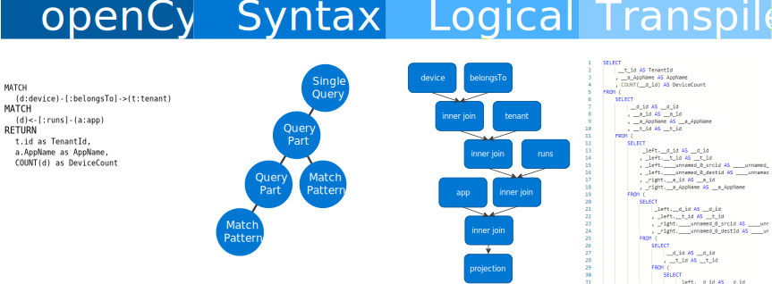

# openCypher Transpiler


This library helps you to build an [openCypher](http://www.opencypher.org/) query layer on top of a relational database or structured data in data lakes. By leveraging this library, you can transpile openCypher query into a target query language used by the relational database. We have provided a sample target language renderer for [T-SQL](https://docs.microsoft.com/en-us/sql/t-sql/language-reference?view=sql-server-2017).

Originally we built this library to support querying the petabyte-scale Windows 10 telemetry data assets in the [Azure Data Lake](https://azure.microsoft.com/en-us/solutions/data-lake/) as a [Property Graph](https://neo4j.com/developer/graph-database/#property-graph). We chose openCypher because it is a declarative query language resembling SQL, which most our data consumers are already familiar with.

This library has three main components:

* A openCypher parser built on top of ANTLR4 and the official openCypher grammar to parse and create an [AST](https://en.wikipedia.org/wiki/Abstract_syntax_tree) to abstract the syntactical structure of the graph query;
* A logic planner transforms the AST into relational query logical plan similar to the [Relational Algebra](https://en.wikipedia.org/wiki/Relational_algebra);
* A query code renderer produces the actual query code from the logical plan. In this repository, we provides a T-SQL renderer.

The above components form a pipeline where the openCypher query and the graph schema is fed to the parser and the transpiled query is the output from the code renderer:



The library, written in [.Net Core](https://dotnet.microsoft.com/download), is cross-platform.

[](https://dev.azure.com/ms/openCypherTranspiler/_build/latest?definitionId=191&branchName=master)

## Using the library

```CSharp
var cypherQueryText = @"
    MATCH (d:device)-[:belongsTo]->(t:tenant)
    MATCH (d)-[:runs]->(a:app)
    RETURN t.id as TenantId, a.AppName as AppName, COUNT(d) as DeviceCount
";

var graphDef = new SimpleProvider();
var plan = LogicalPlan.ProcessQueryTree(OpenCypherParser.Parse(cypherQueryText), graphDef);
var sqlRender = new SQLRenderer(graphDef);
var tSqlQuery = sqlRender.RenderPlan(plan);

Console.WriteLine("Transpiled T-SQL query:");
Console.WriteLine(tSqlQuery);

```
See the full examples in [examples](docs/examples) folder.


## Test designs

Transpiler is tested using the T-SQL target renderer and its results are compared against what is produced by Cypher from the [Neo4j Graph Database](https://neo4j.com/graph-database). Each test compares the query results from the transpiled query on [Microsoft SQL for Linux](https://www.microsoft.com/en-us/sql-server/sql-server-2017) against Cypher on Neo4j 3.x to ensure they are consistent in term of data type and contents.

To run the tests, simply run under the project root folder:
```batch
dotnet test
```

## Road map

### Current work in Progress
* Publish NuGet packages
* Inline conditions with node labels (e.g. MATCH (n:))
* List, collect, UNWIND support

### Issues to address on the horizon
* MATCH pattern with unspecified labels or label patterns maps to more than a single label/relationship type
* MATCH pattern with variable-length relationship
* MATCH pattern in WHERE conditions
* Logical plan is not further optimized and currently offloaded to underlying RDBMS query engine
* Support only read queries (no CREATE/MERGE)
* SQLRenderer: Source table must already been normalized to be used as graph node/edge


## Contributing

This project welcomes contributions and suggestions.  Most contributions require you to agree to a
Contributor License Agreement (CLA) declaring that you have the right to, and actually do, grant us
the rights to use your contribution. For details, visit https://cla.opensource.microsoft.com.

When you submit a pull request, a CLA bot will automatically determine whether you need to provide
a CLA and decorate the PR appropriately (e.g., status check, comment). Simply follow the instructions
provided by the bot. You will only need to do this once across all repos using our CLA.

This project has adopted the [Microsoft Open Source Code of Conduct](https://opensource.microsoft.com/codeofconduct/).
For more information see the [Code of Conduct FAQ](https://opensource.microsoft.com/codeofconduct/faq/) or
contact [opencode@microsoft.com](mailto:opencode@microsoft.com) with any additional questions or comments.
